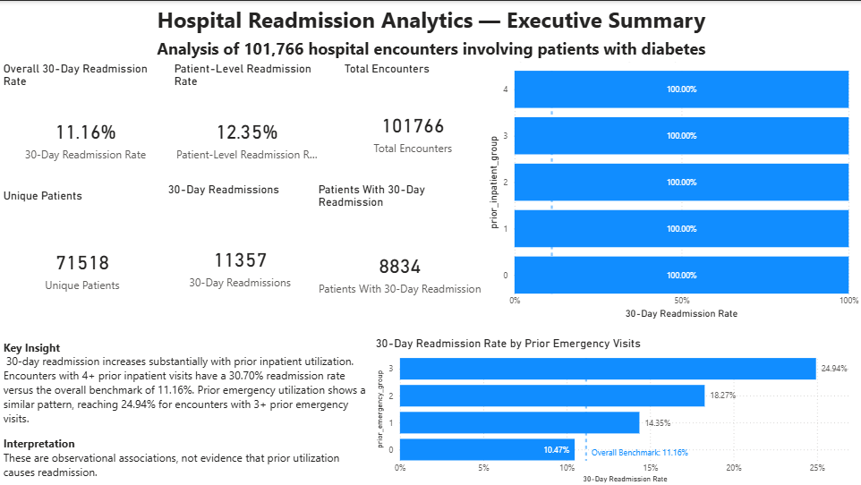
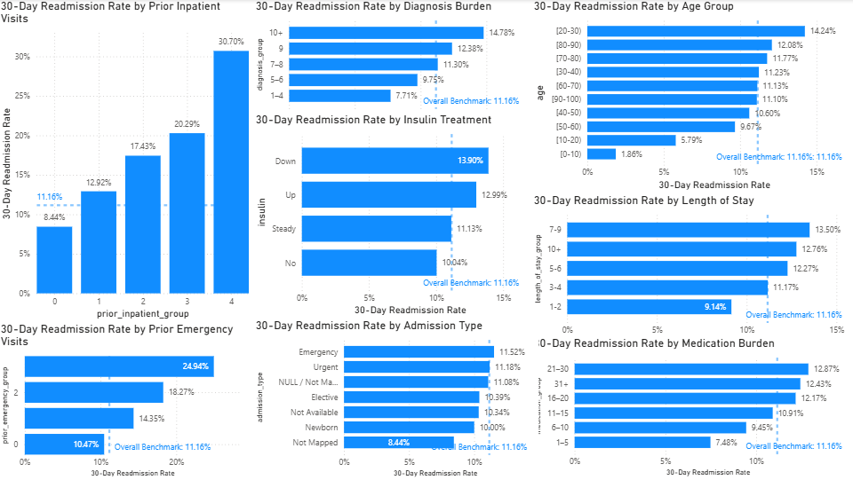

# Hospital Readmission Analytics

An end-to-end healthcare analytics portfolio project analyzing 101,766 hospital encounters involving patients with diabetes to understand patterns associated with 30-day hospital readmission.

The project demonstrates a complete analytics workflow:

**Python → Data Quality & EDA → Exploratory Modeling → SQL Validation → Power BI → Executive Reporting**

---

## Executive Summary

This project analyzes the **Diabetes 130-US hospitals for years 1999–2008** dataset to investigate:

> **What factors are associated with 30-day hospital readmission among patients with diabetes, and what insights can healthcare organizations derive from the data?**

Key results:

| KPI                                             |     Result |
| ----------------------------------------------- | ---------: |
| Total hospital encounters                       |    101,766 |
| Unique patients                                 |     71,518 |
| 30-day readmission encounters                   |     11,357 |
| Encounter-level 30-day readmission rate         | **11.16%** |
| Patients with ≥1 30-day readmission             |      8,834 |
| Patient-level readmission rate                  | **12.35%** |
| Patients with 2+ 30-day readmissions            |      1,539 |
| Share of patients with ≥1 readmission having 2+ | **17.41%** |

The strongest descriptive differences were observed across prior healthcare utilization groups:

* Encounters with **4+ prior inpatient visits** had a 30-day readmission rate of **30.70%**, compared with the overall benchmark of 11.16%.
* Encounters with **3+ prior emergency visits** had a rate of **24.94%**.
* Higher medication, diagnosis, and length-of-stay burden also showed higher observed readmission rates across several groups.

These are **observational associations and should not be interpreted as causal relationships**.

---

## Business Problem

Hospital readmissions can create additional healthcare utilization and may be relevant to care-transition planning, resource allocation, and quality monitoring.

The objective of this project was to transform raw hospital encounter data into a reproducible analytical workflow that could:

1. Measure the overall 30-day readmission rate.
2. Compare encounter-level and patient-level readmission measures.
3. Identify utilization and clinical characteristics associated with different observed readmission rates.
4. Validate analytical findings using SQL.
5. Build an interactive Power BI dashboard.
6. Develop an exploratory predictive model.
7. Translate analytical findings into business-oriented insights while clearly documenting limitations.

---

## Dataset

**Dataset:** Diabetes 130-US hospitals for years 1999–2008

The dataset contains hospital encounters involving patients with diabetes and includes demographic, admission, utilization, medication, laboratory, diagnosis, and readmission information.

### Dataset characteristics

* **101,766 hospital encounters**
* **71,518 unique patients**
* U.S. hospital data
* Historical period: **1999–2008**
* Primary outcome: readmission within 30 days

### Source

Strack, B., De Shazo, J. R., Gennaro, M., et al. (2014).

*Impact of HbA1c Measurement on Hospital Readmission Rates: Analysis of 70,000 Clinical Database Patient Records.*

BioMed Research International, 2014.

The dataset is also available through the UCI Machine Learning Repository.

---

## Analytical Workflow

```text
Raw Dataset
     │
     ▼
Python Data Validation
     │
     ▼
Data Quality Assessment
     │
     ▼
Exploratory Data Analysis
     │
     ▼
Feature Engineering
     │
     ▼
Exploratory Predictive Modeling
     │
     ▼
SQL Validation & Aggregation
     │
     ▼
Power BI Dashboard
     │
     ▼
Executive Report
     │
     ▼
Business Interpretation
```

---

## Data Quality & Preparation

The raw dataset was preserved unchanged.

During preparation:

* `?` placeholders were treated as missing values.
* Columns with extremely high missingness were excluded from the primary analysis:

  * `weight`
  * `max_glu_serum`
  * `A1Cresult`
* A binary `readmitted_30d` variable was created:

  * `1` = original `readmitted` value was `<30`
  * `0` = otherwise
* Utilization groups were created for inpatient, emergency, and outpatient visits.
* Length-of-stay, medication, diagnosis, and laboratory procedure burden groups were created.
* Admission, source, discharge, and diagnosis categories were derived for analysis.

### Important missing-data findings

| Variable          | Missing / Placeholder Count | Approx. Share |
| ----------------- | --------------------------: | ------------: |
| Weight            |                      98,569 |        96.86% |
| Max glucose serum |                      96,420 |        94.75% |
| A1C result        |                      84,748 |        83.28% |
| Medical specialty |                      49,949 |        49.08% |
| Payer code        |                      40,256 |        39.56% |
| Race              |                       2,273 |         2.23% |

The high missingness of several variables was considered before selecting the analytical feature set.

---

## Key Findings

### 1. Prior inpatient utilization

Observed 30-day readmission rates increased substantially across prior inpatient utilization groups.

| Prior inpatient visits | Encounters | Readmission rate |
| ---------------------- | ---------: | ---------------: |
| 0                      |     67,630 |            8.44% |
| 1                      |     19,521 |           12.92% |
| 2                      |      7,566 |           17.43% |
| 3                      |      3,411 |           20.29% |
| 4+                     |      3,638 |       **30.70%** |

The 4+ group was approximately **19.54 percentage points above** the overall 11.16% encounter-level benchmark.

---

### 2. Prior emergency utilization

A similar pattern was observed for prior emergency utilization.

| Prior emergency visits | Readmission rate |
| ---------------------- | ---------------: |
| 0                      |           10.47% |
| 1                      |           14.35% |
| 2                      |           18.27% |
| 3+                     |       **24.94%** |

The 3+ group was approximately **13.78 percentage points above** the overall benchmark.

---

### 3. Patient-level versus encounter-level readmission

The encounter-level rate was **11.16%**, while the patient-level rate was **12.35%**.

Among the 8,834 patients with at least one 30-day readmission:

* 7,295 had 1 readmission
* 1,051 had 2
* 290 had 3
* 198 had 4+

A total of **1,539 patients had 2 or more 30-day readmissions**, representing **17.41% of patients with at least one readmission**.

---

### 4. Length of stay

Observed readmission rates generally increased with length of stay up to the 7–9 day group:

| Length of stay | Readmission rate |
| -------------- | ---------------: |
| 1–2 days       |            9.14% |
| 3–4 days       |           11.17% |
| 5–6 days       |           12.27% |
| 7–9 days       |       **13.50%** |
| 10+ days       |           12.76% |

The relationship was not perfectly linear.

---

### 5. Medication burden

Higher medication burden was associated with higher observed readmission rates across most groups.

The rate increased from **7.48%** for 1–5 medications to **12.87%** for 21–30 medications.

The 31+ group was slightly lower at 12.43%.

---

### 6. Diagnosis burden

Readmission rates also increased across most diagnosis-burden groups:

* 1–4 diagnoses: 7.71%
* 5–6: 9.75%
* 7–8: 11.30%
* 9: 12.38%
* 10+: 14.78%

The 10+ diagnosis group contained only **115 encounters**, so this estimate should be interpreted cautiously.

---

## Exploratory Predictive Modeling

An exploratory logistic regression model was developed to evaluate whether the available features could provide useful discrimination of 30-day readmission.

The modeling workflow included a patient-level split to reduce leakage between training and evaluation data.

### Model performance

| Metric                              | Result |
| ----------------------------------- | -----: |
| ROC-AUC                             | 0.6516 |
| Average Precision                   | 0.1824 |
| Brier Score                         | 0.2301 |
| Precision at threshold 0.5          | 0.1572 |
| Recall at threshold 0.5             | 0.5086 |
| F1 score                            | 0.2401 |
| Encounters flagged at threshold 0.5 | 34.54% |

The model demonstrated **modest discrimination**, and calibration was not considered reliable enough for direct clinical deployment.

This model is therefore presented as an **exploratory analytical exercise rather than a clinical prediction or risk-stratification tool**.

---

## SQL Analysis

SQLite was used as a cross-tool validation layer.

SQL analysis reproduced and validated key findings from the Python analysis, including:

* Overall 30-day readmission rate
* Patient-level readmission rate
* Prior inpatient utilization
* Prior emergency utilization
* Repeated readmissions
* Utilization-based subgroup comparisons
* Benchmark comparisons

This provided an additional quality-control layer before the findings were presented in Power BI.

---

## Power BI Dashboard

The Power BI report contains an **Executive Summary** and detailed analytical pages.

### Executive Summary

The executive page contains six KPI cards:

* Total Encounters
* Unique Patients
* 30-Day Readmissions
* 30-Day Readmission Rate
* Patient-Level Readmission Rate
* Patients With 30-Day Readmission

It also highlights prior inpatient and emergency utilization patterns using the overall 11.16% rate as a descriptive benchmark.

### Detailed analysis

The dashboard includes analysis of:

* Prior inpatient utilization
* Prior emergency utilization
* Prior outpatient utilization
* Age
* Length of stay
* Medication burden
* Diagnosis burden
* Laboratory procedure burden
* Insulin treatment
* Diabetes medication
* Medication change
* Race
* Gender
* Admission type
* Admission source
* Discharge disposition

---

## Dashboard Preview

### Executive Summary

[](06_Screenshots/Executive_Summary.png.png)

### Detailed Analysis

[](06_Screenshots/Detailed_Analysis.png.png)

*Click an image to view the full-size dashboard screenshot.*
---

## Tools & Technologies

| Area                 | Tools            |
| -------------------- | ---------------- |
| Programming          | Python           |
| Data manipulation    | pandas, NumPy    |
| Exploratory analysis | Python, Jupyter  |
| Database / SQL       | SQLite           |
| BI / Visualization   | Power BI Desktop |
| BI calculations      | DAX              |
| Data transformation  | Power Query      |
| Documentation        | Markdown         |
| Version control      | Git / GitHub     |

---

## Project Structure

```text
Hospital-Readmission-Analytics/
│
├── 02_Python_Analysis/
│   ├── 01_data_validation.ipynb
│   └── 02_data_quality_assessment.ipynb
│
├── 03_SQL_Analysis/
│   ├── SQL_Analysis_Notes.md
│   └── hospital_readmission.sqbpro
│
├── 04_PowerBI_Dashboard/
│   └── Hospital_Readmission_Analytics.pbix
│
├── 05_Report/
│   └── Hospital_Readmission_Analytics_Report.pdf
│
├── 06_Screenshots/
│   ├── Executive_Summary.png.png
│   └── Detailed_Analysis.png.png
│
├── .gitignore
└── README.md
```

## Reproducibility

The project follows a reproducible workflow:

1. Original raw data is preserved.
2. Python notebooks document validation, data quality assessment, feature engineering, and exploratory analysis.
3. SQLite contains the SQL analysis environment.
4. SQL queries provide cross-tool validation.
5. Power BI contains the interactive dashboard and DAX measures.
6. The final report documents analytical findings, interpretation, limitations, and recommendations.

The analytical workflow follows:

**Data → Quality → Analysis → Validation → Visualization → Business Insight**

---

## Business Interpretation

The analysis suggests several areas for further investigation:

* High-utilization patient segmentation
* Post-discharge and transitional-care analysis
* Monitoring of repeated readmissions
* Complexity-aware reporting
* Current hospital/provider-level analysis where appropriate identifiers are available
* Cost and resource-utilization analysis
* Validation using contemporary healthcare data

These should be treated as **areas for analytical investigation rather than causal conclusions or prescriptive clinical recommendations**.

---

## Limitations

This project has important limitations:

* The dataset represents U.S. hospital encounters from **1999–2008**.
* It is not directly representative of current healthcare systems or populations.
* The analysis is observational and does not establish causality.
* Several variables contain substantial missingness.
* Some subgroups have relatively small sample sizes.
* Encounter-level and patient-level measures answer different analytical questions.
* The exploratory predictive model has modest discrimination and requires additional calibration and external validation before any operational or clinical application.
* Findings should not be assumed to generalize to Indian hospitals or other healthcare settings without contemporary local validation.

---

## Disclaimer

This project is a **portfolio and educational healthcare analytics demonstration**.

The findings describe observed patterns in a historical observational dataset. They do not establish causal relationships and should not be interpreted as clinical recommendations.

The predictive model is exploratory and is **not intended for clinical decision-making, patient risk stratification, or production deployment**.

Practical application would require contemporary data, appropriate clinical validation, external model validation, privacy and governance controls, calibration, and setting-specific evaluation.

---

## Project Highlights

This project demonstrates experience with:

* Healthcare data analysis
* Data quality assessment
* Missing-data analysis
* Feature engineering
* Exploratory statistical analysis
* SQL analytics
* Cross-tool validation
* Power BI dashboard development
* DAX measures
* Exploratory predictive modeling
* Model performance evaluation
* Executive reporting
* Business interpretation
* Reproducible analytical workflows

---

## Final Takeaway

The project demonstrates an end-to-end healthcare analytics workflow that converts a large historical hospital dataset into validated analytical findings, an interactive Power BI dashboard, an exploratory predictive model, and an executive-level report.

The most pronounced descriptive differences were observed across prior inpatient and emergency utilization groups, while several measures of clinical and treatment complexity also showed higher observed readmission rates across higher-burden groups.

The project emphasizes not only analytical results, but also **data quality, cross-tool validation, reproducibility, appropriate statistical interpretation, and clear communication of limitations**.
